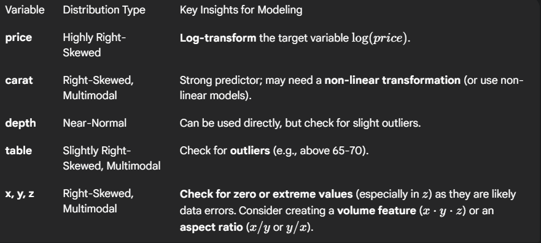

```markdown
# Gemstone Price Predictor

### 📈 Predict the price of diamonds and gemstones with Machine Learning

This project predicts the **price of gemstones** based on their key features such as **carat, cut, color, clarity, depth, and table**.  
It uses a **CatBoost Regression Model** trained on real diamond data and is deployed using **Streamlit Cloud** for an interactive experience.

---

## 🚀 Demo

🔗 **Live App:** [Gemstone Price Predictor (Streamlit)](https://your-streamlit-app-url)  
📂 **GitHub Repo:** [Gemstone Price Predictor](https://github.com/yourusername/Gemstone-Price-Predictor)

---

## 🧠 Features

- 🖥️ User-friendly web interface built with **Streamlit**
- 💎 Predict gemstone prices instantly
- 📊 Dropdown menus for categorical features (`cut`, `color`, `clarity`)
- 🤖 Uses **CatBoost Regressor** for high accuracy
- ☁️ Ready for deployment on **Streamlit Cloud**

---

## 🧩 Tech Stack

| Component | Technology Used |
|------------|-----------------|
| Programming Language | Python 🐍 |
| Frontend | Streamlit |
| Machine Learning | CatBoost Regressor |
| Data Analysis | Pandas, NumPy |
| Visualization | Matplotlib, Seaborn |
| Model Storage | Joblib (`.pkl` file) |


---

## ⚙️ Installation and Setup

Follow these steps to run the project locally 👇

```bash
# 1️⃣ Clone the repository
git clone https://github.com/yourusername/Gemstone-Price-Predictor.git
cd Gemstone-Price-Predictor

# 2️⃣ Create a virtual environment (optional but recommended)
python -m venv gemenv
gemenv\Scripts\activate   # For Windows
source gemenv/bin/activate  # For Mac/Linux

# 3️⃣ Install dependencies
pip install -r requirements.txt

# 4️⃣ Run the Streamlit app
streamlit run main.py
````

---

## 🧮 Model Training

The model (`final_model.pkl`) was trained on a **diamond dataset** from Kaggle using `CatBoostRegressor`.

### 🎯 Input Features:

* `carat` — Weight of the diamond
* `cut` — Quality of the cut (Fair, Good, Very Good, Premium, Ideal)
* `color` — Diamond color grading (D–J)
* `clarity` — Diamond clarity grading (I1–IF)
* `depth` — Total depth percentage
* `table` — Width of the diamond’s top relative to its widest point
* `x`, `y`, `z` — Dimensions of the diamond (in mm)

### 🧠 Target Variable:

* `price` — Diamond price in USD 💰

---

## 🧾 requirements.txt

Make sure your `requirements.txt` file includes:

```
streamlit
pandas
numpy
catboost
scikit-learn
joblib
```

---

## 🎨 Streamlit UI Theme (Optional)

If you want to customize your Streamlit theme, create a file:

**`.streamlit/config.toml`**

```toml
[theme]
primaryColor="#00C853"
backgroundColor="#0E1117"
secondaryBackgroundColor="#262730"
textColor="#FAFAFA"
font="sans serif"
```

---

## 🖼️ App Preview



---

## 🧑‍💻 Author

**Ashish Raj**
🎓 B.Tech in Computer Science (Data Science) — Brainware University
📍 Patna, Bihar, India

🔗 [LinkedIn](https://www.linkedin.com/in/ashish-raj-tech/)
🐙 [GitHub](https://github.com/Ashish570raj)

---

## ⭐ Contributing

Want to make improvements?

1. Fork the repository
2. Create your feature branch

   ```bash
   git checkout -b feature-XYZ
   ```
3. Commit your changes

   ```bash
   git commit -m "Add new feature"
   ```
4. Push to the branch

   ```bash
   git push origin feature-XYZ
   ```
5. Open a **Pull Request**

---

## 📜 License

This project is open source and available under the **MIT License**.

---

## 💬 Feedback

If you have any feedback, suggestions, or issues, feel free to reach out or create an issue on GitHub.

> Made with ❤️ by **Ashish Raj**

---

```

---

Would you like me to generate a **`main.py`** (Streamlit UI + model loading + dropdown inputs + price prediction) that fits perfectly with this structure?
```
